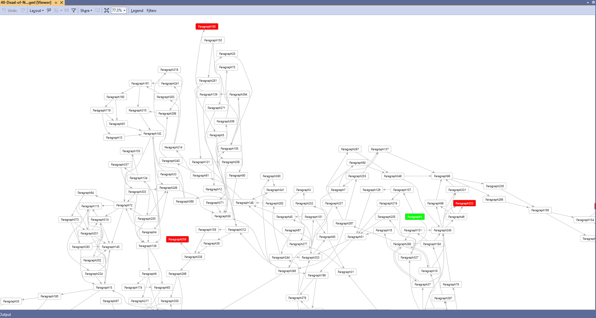

## Introduction

ffdgml is command line application to convert a 'really simple graph' file into a DGML file.


## Repository

The ffdgml repository contains the source code for the  ffdgml application, as well as the 'really simple graph' files (/resources/txt) and dgml files (/resources/dgml)  for Fighting Fantasy gamebooks.


## Download

Compiled downloads are not available.


## Compiling

To clone and run this application, you'll need [Git](https://git-scm.com) and [.NET](https://dotnet.microsoft.com/) installed on your computer. From your command line:

```
# Clone this repository
$ git clone https://github.com/btigi/ffdgml

# Go into the repository
$ cd src

# Build  the app
$ dotnet build
```

## Usage

ffdgml is a command line application and should be run from a terminal session. The application accepts three command line parameters, in a fixed order with no argument specifier:

inputfile - The 'really simple graph' file to convert.
outputfile - The dgml file to create. The file is overwritten if it exists.
successparagraph - The identifier of the success paragraph (usually 400)

Example usage
 ```ffdgml 40-Dead-of-Night.txt 40-Dead-of-Night.dgml 400```

The resultant DGML file can be viewed in Visual Studio (by installing the DGML editor individual component) or in Visual Studio Code via the DGMLViewer extension.

The starting paragraph (1) and the success paragraph are coloured green. Death paragraphs are coloured red.




## 'Really Simple Graph' file

A 'really simple graph' file is a plain text file consisting of blocks separated by blank lines. The first line of a block indicates it's id, and subsequent lines indicates other blocks this block links to.

This example contains three blocks, identifiers 1, 2 and 3. Block 1  links to block 15 and block 267,  block 2 links to block 17 and block 306, while block 3 links to no other blocks, i.e. the player has died (or won).
```
1
15
267

2
17
306

3
```

The format exists in order to be perhaps the fastest way to transcribe the paragraph relationships into text.


## Licencing

ffdgml is licensed under [Mozilla Public Licence](https://www.mozilla.org/en-US/MPL/2.0/)